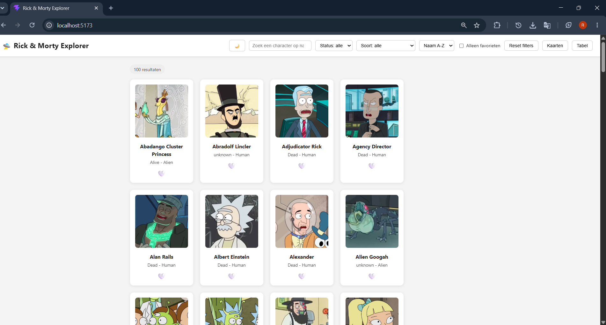
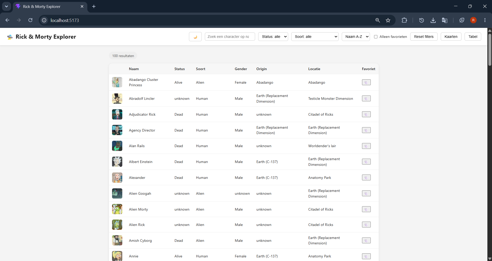
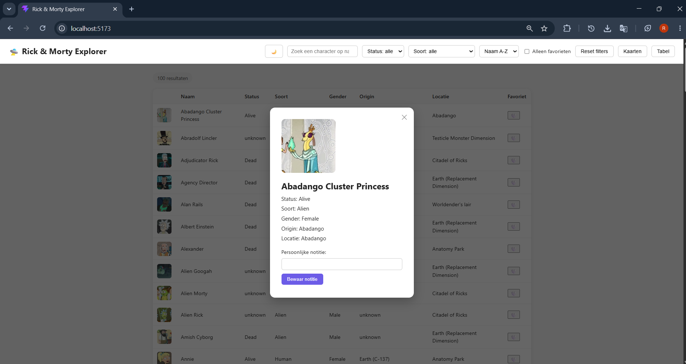
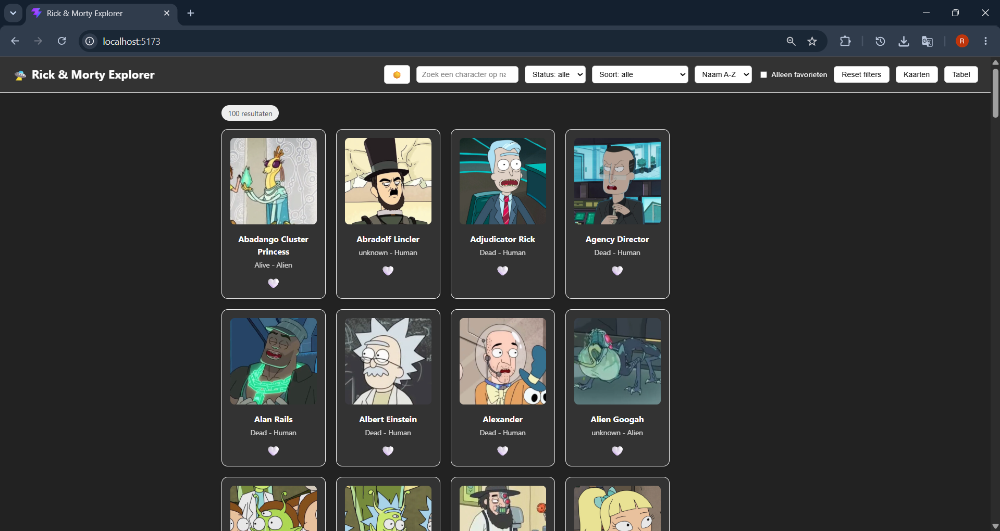
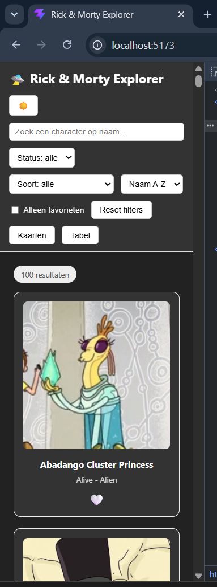

# 🛸 Rick & Morty Explorer

Interactieve Single Page Application voor het vak **Web Advanced**. Een SPA waarmee je Rick and Morty-personages kan verkennen, doorzoeken, filteren, sorteren en als favoriet bewaren — gebouwd met vanilla JavaScript en Vite (geen framework), zodat alle DOM- en JS-concepten rechtstreeks zichtbaar en uitlegbaar blijven.

## Inhoudstafel

- [Projectbeschrijving en functionaliteiten](#projectbeschrijving-en-functionaliteiten)
- [Gebruikte API](#gebruikte-api)
- [Screenshots](#screenshots)
- [Installatiehandleiding](#installatiehandleiding)
- [Projectstructuur](#projectstructuur)
- [Technische vereisten — implementatie](#technische-vereisten--implementatie)
- [Gebruikte bronnen](#gebruikte-bronnen)
- [AI-gebruik](#ai-gebruik)

## Projectbeschrijving en functionaliteiten

**Dataverzameling & weergave**
- Data wordt opgehaald via `fetch` (826+ personages, telkens 20 per API-pagina)
- Twee weergaves: **kaartweergave** en **tabelweergave** (8 kolommen), te wisselen via knoppen
- Klik op een personage (kaart of tabelrij) opent een detail-modal met status, soort, gender, origin, locatie

**Interactiviteit**
- Zoekfunctie op naam (live, bij elke toetsaanslag)
- Filters op status en soort (soort-lijst wordt dynamisch opgebouwd uit de opgehaalde data)
- Sorteren op naam (A-Z / Z-A)
- Alles hierboven werkt **gecombineerd**: zoeken, filteren, sorteren en de "alleen favorieten"-schakelaar tellen allemaal tegelijk mee
- Eén klik om alle filters (zoekterm, status, soort, sortering, favorieten) terug te zetten naar hun standaardwaarde
- Automatisch bijladen van meer personages bij het scrollen (infinite scroll)

**Personalisatie**
- Favorieten togglen (hartje-knop op elke kaart/rij), bewaard in LocalStorage
- Dark/light thema-switcher, bewaard in LocalStorage
- Persoonlijke notitie per personage (met validatie), bewaard in LocalStorage
- "Alleen favorieten"-filter

**Gebruikerservaring**
- Responsive: op smalle schermen (≤480px) worden zoekveld en kaarten volledig breed
- Hover-animatie op kaarten, "pop"-animatie op het hartje bij klikken
- Duidelijke resultaattelling en een nette melding wanneer een filtercombinatie niets oplevert
- Foutmelding bij een mislukte data-ophaling i.p.v. een stille crash

## Gebruikte API

**[The Rick and Morty API](https://rickandmortyapi.com/)** — gratis, geen API-key nodig.

Gebruikt endpoint: `GET https://rickandmortyapi.com/api/character?page=N`

Documentatie: https://rickandmortyapi.com/documentation

## Screenshots







## Installatiehandleiding

Vereisten: [Node.js](https://nodejs.org/) (v18+) en npm.

```bash
# 1. Repository klonen
git clone https://github.com/ramdaniachraf/web-advanced-project.git
cd web-advanced-project

# 2. Dependencies installeren
npm install

# 3. Ontwikkelserver starten
npm run dev
```

Open daarna [http://localhost:5173](http://localhost:5173) in je browser.

```bash
npm run build     # productie-build (output in dist/)
npm run preview   # preview van de productie-build
```

## Projectstructuur

```
web-advanced-project/
├── index.html          # HTML-structuur (header met filters, modal-skeleton)
├── package.json
├── src/
│   ├── main.js          # volledige app-logica: state, rendering, events, filters
│   ├── api.js           # fetch-logica naar de Rick and Morty API
│   └── style.css        # alle styling (flexbox, animaties, responsive)
├── public/
│   └── favicon.svg
└── dist/                # productie-build (via npm run build)
```

## Technische vereisten — implementatie

### DOM-manipulatie

| Concept | Bestand + lijn |
|---|---|
| Elementen selecteren (`querySelector`) | [main.js:8-26](src/main.js#L8-L26) |
| Elementen manipuleren (`createElement`, `textContent`, `appendChild`) | [main.js:85-122](src/main.js#L85-L122) (renderGrid), [main.js:128-204](src/main.js#L128-L204) (renderTable), [main.js:283-340](src/main.js#L283-L340) (openModal) |
| Elementen manipuleren (`.style.property`) | [main.js:40-57](src/main.js#L40-L57) (thema), [main.js:267-273](src/main.js#L267-L273) (lege-staat), [main.js:339](src/main.js#L339) (modal tonen) |
| Events koppelen (`addEventListener`) | [main.js:102, 106, 113](src/main.js#L102) (per kaart-element), [main.js:406-433](src/main.js#L406-L433) (filters/knoppen, incl. reset) |

### Modern JavaScript

| Concept | Bestand + lijn |
|---|---|
| Constanten (`const`) | Overal, bv. [api.js:4](src/api.js#L4), [main.js:8-26](src/main.js#L8-L26) |
| Template literals | [api.js:10, 16](src/api.js#L10), [main.js:109, 294-300](src/main.js#L294-L300) |
| Iteratie over arrays (`for...of`) | [main.js:88](src/main.js#L88) (renderGrid), [main.js:154](src/main.js#L154) (renderTable), [main.js:217, 224, 228](src/main.js#L217-L228) (fillSpeciesFilter) |
| Array methodes (`filter`, `sort`, `includes`, `push`) | [main.js:249-258](src/main.js#L249-L258) (filter), [main.js:260-262](src/main.js#L260-L262) (sort), [main.js:72-78](src/main.js#L72-L78) (includes + push) |
| Arrow functions | Overal, bv. [main.js:59-63](src/main.js#L59-L63), [main.js:249-258](src/main.js#L249-L258) |
| Ternary operator | [main.js:112](src/main.js#L112) (hartje-icoon), [main.js:208](src/main.js#L208) (grid/tabel kiezen), [main.js:261](src/main.js#L261) (sorteervolgorde), [main.js:61](src/main.js#L61) (thema opslaan) |
| Callback functions | Event listener-callbacks overal, `.filter()`/`.sort()`-callbacks ([main.js:249, 260](src/main.js#L249)), `entries.forEach`-callback ([main.js:396](src/main.js#L396)) |
| Promises | `fetch()` geeft een Promise terug ([api.js:10](src/api.js#L10)) |
| Async & Await | [api.js:9](src/api.js#L9) (`getCharacters`), [main.js:344](src/main.js#L344) (`showCharacters`), [main.js:368](src/main.js#L368) (`loadMoreCharacters`) |
| Observer API | [main.js:395-403](src/main.js#L395-L403) (`IntersectionObserver` voor infinite scroll) |

### Data & API

| Concept | Bestand + lijn |
|---|---|
| Fetch | [api.js:10](src/api.js#L10) |
| JSON manipuleren en weergeven | [api.js:19](src/api.js#L19) (`response.json()`), [main.js:31, 77](src/main.js#L31) (`JSON.parse`/`JSON.stringify` voor favorieten in LocalStorage) |

### Opslag & validatie

| Concept | Bestand + lijn |
|---|---|
| Formuliervalidatie | [main.js:324-332](src/main.js#L324-L332) (notitie: lege input geeft foutmelding, geldige input een bevestiging) |
| LocalStorage | [main.js:31-32](src/main.js#L31-L32) (laden), [main.js:61, 77, 329](src/main.js#L61) (opslaan: thema, favorieten, notities) |

### Styling & layout

| Concept | Bestand + lijn |
|---|---|
| Flexbox | [style.css:14](src/style.css#L14) (header), [style.css:89](src/style.css#L89) (character-container) |
| Basis CSS | [style.css](src/style.css) (volledig bestand) |
| Responsive design | [style.css:184-196](src/style.css#L184-L196) (`@media (max-width: 480px)`) |
| Animaties | [style.css:105-108](src/style.css#L105-L108) (kaart-hover), [style.css:135-143](src/style.css#L135-L143) (hartje-pop) |
| Gebruiksvriendelijke elementen | Hartje-knop ([main.js:111-113](src/main.js#L111-L113)), sluitknop modal ([index.html:53](index.html#L53)), reset-filters-knop ([index.html:37](index.html#L37)), view-toggle- en thema-knoppen ([index.html:12, 39-40](index.html#L12)) |

### Asynchroon Web Dev

`async`/`await` wordt consequent gebruikt voor elke API-call: [api.js:9](src/api.js#L9) (`getCharacters`), [main.js:344](src/main.js#L344) (`showCharacters`, eerste keer laden), [main.js:368](src/main.js#L368) (`loadMoreCharacters`, infinite scroll). Foutafhandeling via `try/catch/finally` op alle drie de plekken.

### Fetch en datamanipulatie

`api.js` haalt data op en geeft het **volledige** API-antwoord terug (`data.results` + `data.info.next`), zodat `main.js` zowel de personages als de paginering-informatie kan gebruiken ([api.js:9-25](src/api.js#L9-L25)). Favorieten worden apart bijgehouden als een eigen array van ID's ([main.js:29](src/main.js#L29)), losstaand van de ruwe API-data.

### Tooling & structuur

| Vereiste | Status |
|---|---|
| Vite | Project opgezet via `npm create vite` (vanilla JS template) |
| Folderstructuur | `index.html` in de root, JavaScript in `src/`, styling in `src/style.css` |

## Gebruikte bronnen

- [The Rick and Morty API](https://rickandmortyapi.com/) — dataset
- Cursusmateriaal Web Advanced (Canvas, modules 0 t.e.m. 9) — elk technisch concept in dit project is expliciet geverifieerd tegen de effectieve lesinhoud van deze modules, niet enkel tegen de titels
- [MDN Web Docs](https://developer.mozilla.org/) — naslagwerk
- AI-assistentie: zie [AI-gebruik](#ai-gebruik) hieronder

## AI-gebruik
https://claude.ai/share/c1f23ea9-6892-4dd1-a4ef-f5ed055ac990
Ik gebruikte AI om concepten te begrijpen waar ik moeilijkheden mee had vooral voor code te verbeteren en helpen als ik vast zat. Bijna alle code heb ik zelf geschreven en heb de suggesties van claude gebruikt waar nodig.


